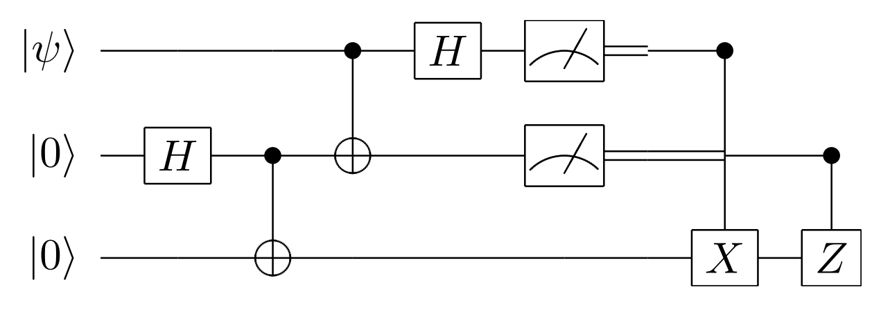

# Bachelor’s Thesis: Application of graph partitioning algorithms and genetic algorithms for optimizing teleportation costs in distributed quantum circuits

**Author:** Teodor Slaveykov

This README provides an overview of the content associated with the bachelor's thesis.

## Contents:

1. **Literature Folder:**
   - Contains images and PDF files used within the thesis.

2. **Thesis PDF:**
   - [Teodor_BA.pdf](Teodor_BA.pdf) - The complete bachelor's thesis in a readable format.

3. **Extended Abstract PDF:**
   - [Abstract_English.pdf](Abstract_English.pdf) - A summary of the main content and results.

4. **DQC Partition Folder:**
   - Contains various Python files for qubit partitioning.
   
   - **GA.py:**
     - Random qubit partitioning using the Genetic Algorithm into 4 partitions.
   
   - **KerLin.py:**
     - Qubit partitioning using the Kernighan-Lin algorithm into 4 partitions.
   
   - **Spectral.py:**
     - Spectral Partitioning into 4 partitions.
   
   - **GA_MKL.py** and **GA_SP.py:**
     - Two hybrid Genetic Algorithms (HGAs).

   - **GA_KL.py:**
     - Verification of results based on the scientific article by Zomorodi & Co., considering 2 partitions.
   
   - **QiskitTranspiler.py:**
     - Converts benchmark circuits from RevLib into OpenQasm 2.0 format.
   
   - **Experiments_for_Verification.py:**
     - Presents and compares results with Zomorodi & Co. for 2 partitions.

5. **qasm Folder:**
   - Contains 9 benchmark circuits in OpenQasm 2.0 format.

Feel free to explore the files and folders for more details and information related to the thesis.

